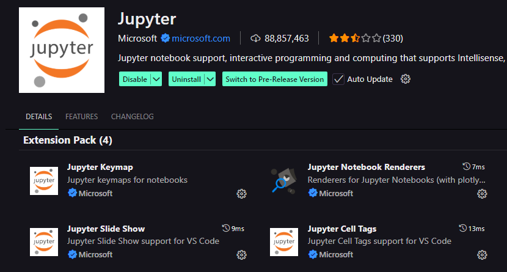

<h1 style = "text-align: center; ">Customer Churn Analysis</h1>


## Table of Contents
- [Table of Contents](#table-of-contents)
- [Project Overview](#project-overview)
	- [What is Customer Churn?](#what-is-customer-churn)
	- [Objective](#objective)
	- [Key Features](#key-features)
	- [Dataset](#dataset)
	- [Project Structure](#project-structure)
- [Getting Started](#getting-started)
	- [Tools and Dependencies](#tools-and-dependencies)
	- [Steps to Run the Code](#steps-to-run-the-code)
- [GitHub Link](#github-link)
- [Contributor](#contributor)

## Project Overview
### What is Customer Churn?
Customer Churn or Customer Attritionis the number of existing customers lost, for any reason at all, over a given period of time. It is an important metric for bussinesses metric especially for subscription-based businesses as it impact revenue and growth. 
### Objective
The goal of the project is to analyze customer churn dataset to find key factors that contributing into customer churn.
### Key Features
- **Age Analysis:** Create age distribution and analyst churn rate by age group, age is typically divided into 3 categories which are Young, Middle and Old. 
- **Churn Analysis:** Measuring the overall churn rate in the dataset which usually expressed on percentage.
- **Contract Length Analysis:** Analyst the impact of contract length on churn rate. It is expressed as Monthly, Annually or Quarterly.
- **Tenure Analysis:** Analyze does the amount of time customers have been with the company impact on churn.
- **Correlation Analysis:** Discover the overall correlation between all features (age, tenure, support calls, …) and churn rate. 
- **Gender Analysis:** Analyst churn rate by gender group which are male and female. 
- **Last Interaction Analysis:** Analyze the correlation between recent interactions and churn rate. Last interaction is typically measured in days. 
- **Payment Delay Analysis:** Investigate whether payment delays (measured as days or months) serve as an early warning sign for churn.
- **Subscription Type Analysis:** Examine which subscription plans lead to higher customer engagement and retention. Some subscription plans such as Basic, Standard, Premium.
- **Support Call Analysis:** Determine if frequency support calls indicate frustration or act as a retention tool for customers. 
- **Usage Rate Analysis:** Analyze whether the usage rate of customer in period of tenure correlates with churn.
- **Total Spend Analysis:** Assess whether higher-paying customers are more likely to stay longer. Totals spend is measured in currency. 
- **Initial Analysis:** Understand the dataset	including structure, checking for nulls. This could help further analysis


### Dataset
Data Source: [Customer Churn Analysis](https://www.kaggle.com/datasets/muhammadshahidazeem/customer-churn-dataset)

But we only test on 500 and 1000 records dataset.

Understanding Dataset
| Column   | Description |
|---|---|
|Customer ID| Unique identifier for each customer  |
|Age|Age of each customer|
|Gender|Male or Female|
|Tenure|How long the customers have been with the company measured as **month**|
|Usage Frequency|Number of times customers have used the service|
|Support Calls|Number of times customers have taked the support call|
|Payment Delay|How long customers have delay the payment|
|Subscription Type|Type of service subscription|
|Contract Length|Duration of customers contract|
|Total Spend|Total money customers spend on the service|
|Last Interaction|The number of days since customer last use of service|
|Churn|Binary value indicate customer **churn (1)** or **non-churn (0)**|

### Project Structure

```plaintext
Customer_Churn_Analysis/
├── data/
│   ├── data_500_rec.csv                   # Dataset 500 records
│   └── data_1000_rec.csv	           # Dataset 1000 records
├── public/				   # Store assets
├── src/
│   ├── __init__.py                        # Making feature_analysis a package
│   ├── age_analysis.py                    # Age Analysis Feature
│   ├── base_analysis.py                   # Feature Analysis Abstract Base Class
│   ├── churn_analysis.py                  # Churn Analysis Feature
│   ├── contract_analysis.py               # Contract Analysis Feature
│   ├── correlation_analysis.py            # Overall Correlation Analysis Feature
│   ├── gender_analysis.py                 # Gender Analysis Feature
│   ├── initial_analysis.py                # Initial Analysis Feature
│   ├── last_interaction_analysis.py       # Last Interaction Analysis Feature
│   ├── main.ipynb                         # Main Python Notebook to run Analysis Features
│   ├── payment_delay_analysis.py          # Payment Delay Analysis Feature
│   ├── subscription_analysis.py           # Subscription Analysis Feature
│   ├── support_call_analysis.py           # Support Call Analysis Feature
│   ├── tenure_analysis.py                 # Tenure Analysis Feature
│   ├── total_spend_analysis.py            # Total Spend Analysis Feature
│   └── usage_frequency_analysis.py        # Usage Frequency Analysis Feature
├── requirements.txt                       # Project Dependencies
└── README.md                              # Project Guide
```
## Getting Started
### Tools and Dependencies
- Programming Languages<br>
 <br><br>

- Python Libraries<br>
 


### Steps to Run the Code
1. Clone the repository
```bash
git clone https://github.com/Leangchhay1523/Customer_Churn_Analysis.git
```
2. Install dependencies
```bash
cd Customer_Churn_Analysis
pip install -r requirements.txt
```
3. Install ``Jupyter`` notebook extension on VSCode
	- Open VSCode
	- Go to **Extensions**, search **Jupyter** and install it.

4. Run the project on ``main.ipynb``

## GitHub Link
- [GitHub Repo](https://github.com/Leangchhay1523/Customer_Churn_Analysis)
## Contributor
Contribute to the projects:
- [PunleuTY](https://github.com/PunleuTY)
- [Sitharath-s](https://github.com/Sitharath-s)
- [Leangchhay1523](https://github.com/Leangchhay1523)
